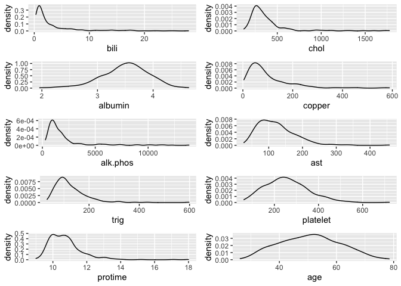
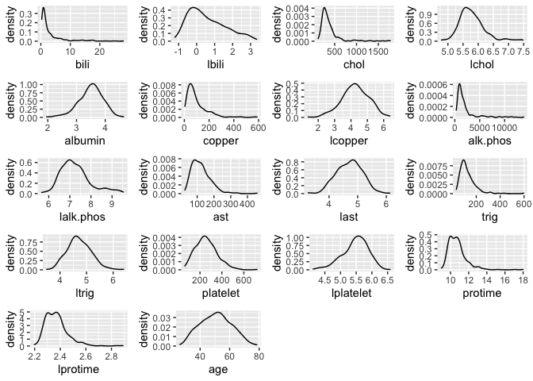
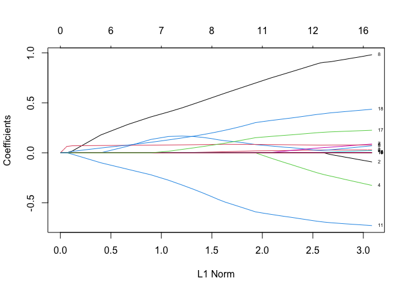
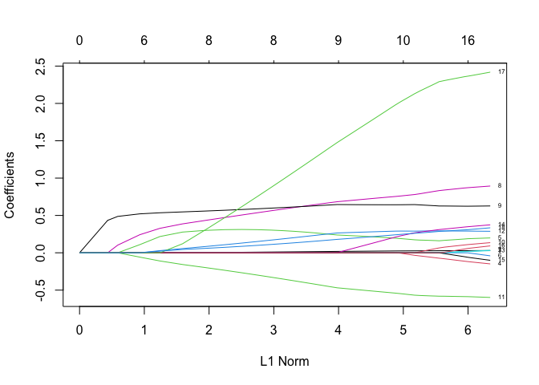
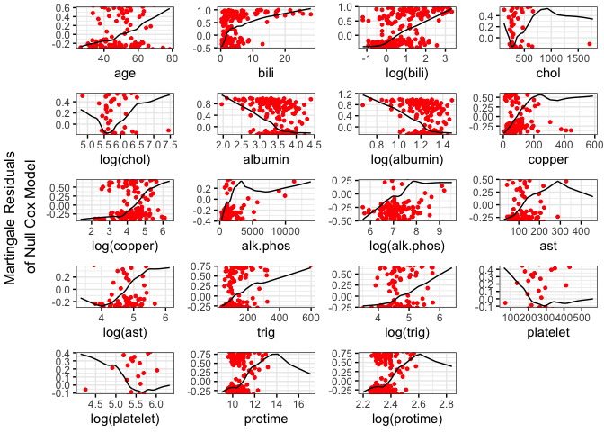
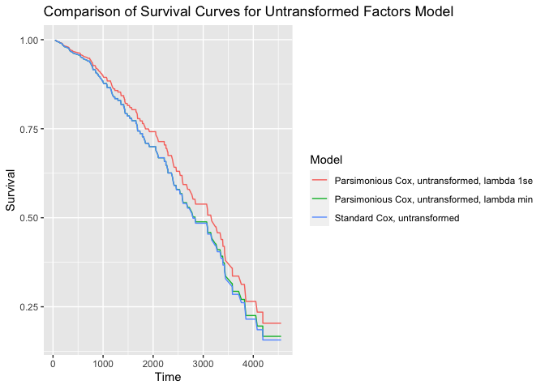
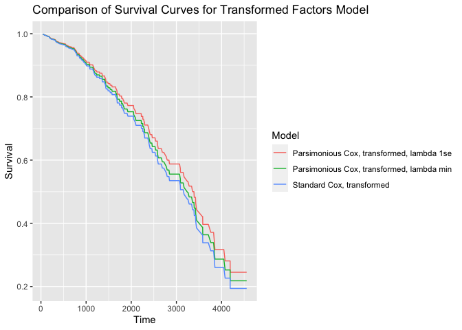
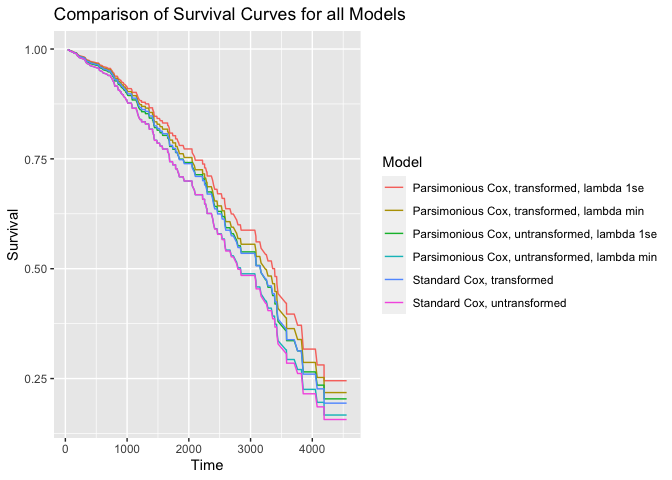

Survival Analysis with the Primary Biliary Cholangitis (PBC) Dataset
================
Lucas Mendicino

## General Question: In this dataset from a randomized trial, what baseline factors predict mortality?

## Overview

In this project, I use the Primary Biliary Cirhosis (PBC) data set from
the Mayo Clinic trial conducted between the years 1974 to 1984. PBC is
an autoimmune disease leading to destruction of the small bile ducts in
the liver. I first do exploratory data analysis, providing summary
statistics of the baseline factors and an assessment of normality with
density plots and normality statistics. I assess log transformations of
numerical factors here. Next, I employ a standard Cox regression model
for survival with each factor as a predictor. I then use LASSO (Least
Absolute Shrinkage and Selection Operator) to identify a parsimonious
set of variables to predict survival. I do this using the data set as it
is, then using log transformed factors. I propose the model I believe
best predicts survival. Then, I assess non-linear associations between
the factors and the time to event outcome by inspecting the functional
form of continuous variables against martingale residuals and then
splines to assess nonlinear terms. Lastly, I provide survival curves of
the models and a summary about the results of my analysis.

## 1.) Assessment of the normality of each of the candidate variables and summary statistics.

Let’s load the data from the survival package.

``` r
data(pbc, package = 'survival')
```

Let’s look at the variables in the data set

``` r
str(pbc)
```

    ## 'data.frame':    418 obs. of  20 variables:
    ##  $ id      : int  1 2 3 4 5 6 7 8 9 10 ...
    ##  $ time    : int  400 4500 1012 1925 1504 2503 1832 2466 2400 51 ...
    ##  $ status  : int  2 0 2 2 1 2 0 2 2 2 ...
    ##  $ trt     : int  1 1 1 1 2 2 2 2 1 2 ...
    ##  $ age     : num  58.8 56.4 70.1 54.7 38.1 ...
    ##  $ sex     : Factor w/ 2 levels "m","f": 2 2 1 2 2 2 2 2 2 2 ...
    ##  $ ascites : int  1 0 0 0 0 0 0 0 0 1 ...
    ##  $ hepato  : int  1 1 0 1 1 1 1 0 0 0 ...
    ##  $ spiders : int  1 1 0 1 1 0 0 0 1 1 ...
    ##  $ edema   : num  1 0 0.5 0.5 0 0 0 0 0 1 ...
    ##  $ bili    : num  14.5 1.1 1.4 1.8 3.4 0.8 1 0.3 3.2 12.6 ...
    ##  $ chol    : int  261 302 176 244 279 248 322 280 562 200 ...
    ##  $ albumin : num  2.6 4.14 3.48 2.54 3.53 3.98 4.09 4 3.08 2.74 ...
    ##  $ copper  : int  156 54 210 64 143 50 52 52 79 140 ...
    ##  $ alk.phos: num  1718 7395 516 6122 671 ...
    ##  $ ast     : num  137.9 113.5 96.1 60.6 113.2 ...
    ##  $ trig    : int  172 88 55 92 72 63 213 189 88 143 ...
    ##  $ platelet: int  190 221 151 183 136 NA 204 373 251 302 ...
    ##  $ protime : num  12.2 10.6 12 10.3 10.9 11 9.7 11 11 11.5 ...
    ##  $ stage   : int  4 3 4 4 3 3 3 3 2 4 ...

The PBC data set has 418 subjects, 312 of which were in the randomized
trial, and an additional 106 subjects not in the trial. There are 17
candidate variables (10 numeric, 7 categorical):

-   Numeric: age, bili, chol, albumin, cooper, alk.phos, ast, trig,
    platelet, protime
-   Categorical: sex, trt, ascites, hepato, spiders, edema, stage

Let’s get summary statistics of the variables:

``` r
pbc2 <- data.frame(pbc)

pbc2 <- pbc2 %>%
    mutate(status = factor(status, levels = c(0,1,2), labels = c("Censored", "Transplant", "Dead")),
           ascites = factor(ascites, levels = c(0,1), labels = c("Absent","Present")),
           edema = factor(edema, levels = c(0, 0.5, 1), labels = c("No edema","Untreated or successfully treated","edema despite diuretic therapy")),
           hepato = factor(hepato, levels = c(0,1), labels = c("Absent","Present")),
           stage = factor(stage),
           trt = factor(trt, levels = c(1,2), labels = c("D-penicillmain", "Placebo"))) %>%
  rename("Endpoint Status" = status, "Treatment" = trt, "Age in years" = age, "Sex" = sex, 
         "Ascites" = ascites, "Hepatomegaly" = hepato, "Spiders Angioma" = spiders,
          "Edema" = edema, "Serum Bilirubin mg/dl" = bili, "Serum Cholesterol mg/dl" = chol, 
          "Serum Albumin g/dl" = albumin, "Urine Copper ug/day" = copper,
          "Alkaline Phosphotase U/liter" = alk.phos, "Triglicerides mg/dl" = trig, 
          "Platelet Count" = platelet, "Blood Clotting Time in seconds" = protime, "Histoligic Stage" = stage,
          "Aspartate Aminotransferase U/ml" = ast) %>%
  select(-id)

print(CreateTableOne(data = pbc2), nonnormal = c("Serum Bilirubin mg/dl", 
                              "Serum Cholesterol mg/dl", "Serum Albumin g/dl", "Urine Copper ug/day", 
                              "Alkaline Phosphotase U/liter", "Aspartate Aminotransferase U/ml",
                              "Triglicerides mg/dl", "Platelet Count", "Blood Clotting Time in seconds"))
```

    ##                                                 
    ##                                                  Overall                  
    ##   n                                                  418                  
    ##   time (mean (SD))                               1917.78 (1104.67)        
    ##   Endpoint Status (%)                                                     
    ##      Censored                                        232 (55.5)           
    ##      Transplant                                       25 ( 6.0)           
    ##      Dead                                            161 (38.5)           
    ##   Treatment = Placebo (%)                            154 (49.4)           
    ##   Age in years (mean (SD))                         50.74 (10.45)          
    ##   Sex = f (%)                                        374 (89.5)           
    ##   Ascites = Present (%)                               24 ( 7.7)           
    ##   Hepatomegaly = Present (%)                         160 (51.3)           
    ##   Spiders Angioma (mean (SD))                       0.29 (0.45)           
    ##   Edema (%)                                                               
    ##      No edema                                        354 (84.7)           
    ##      Untreated or successfully treated                44 (10.5)           
    ##      edema despite diuretic therapy                   20 ( 4.8)           
    ##   Serum Bilirubin mg/dl (median [IQR])              1.40 [0.80, 3.40]     
    ##   Serum Cholesterol mg/dl (median [IQR])          309.50 [249.50, 400.00] 
    ##   Serum Albumin g/dl (median [IQR])                 3.53 [3.24, 3.77]     
    ##   Urine Copper ug/day (median [IQR])               73.00 [41.25, 123.00]  
    ##   Alkaline Phosphotase U/liter (median [IQR])    1259.00 [871.50, 1980.00]
    ##   Aspartate Aminotransferase U/ml (median [IQR])  114.70 [80.60, 151.90]  
    ##   Triglicerides mg/dl (median [IQR])              108.00 [84.25, 151.00]  
    ##   Platelet Count (median [IQR])                   251.00 [188.50, 318.00] 
    ##   Blood Clotting Time in seconds (median [IQR])    10.60 [10.00, 11.10]   
    ##   Histoligic Stage (%)                                                    
    ##      1                                                21 ( 5.1)           
    ##      2                                                92 (22.3)           
    ##      3                                               155 (37.6)           
    ##      4                                               144 (35.0)

``` r
pbc2 %>% select(-time) %>% 
  tbl_summary(statistic = list(all_continuous() ~ "{median} ({p25}, {p75})",
                     all_categorical() ~ "{n} ({p}%)"),
                    digits = all_continuous() ~ 2,)
```

<div id="icvigbmuaa" style="overflow-x:auto;overflow-y:auto;width:auto;height:auto;">
<style>html {
  font-family: -apple-system, BlinkMacSystemFont, 'Segoe UI', Roboto, Oxygen, Ubuntu, Cantarell, 'Helvetica Neue', 'Fira Sans', 'Droid Sans', Arial, sans-serif;
}

#icvigbmuaa .gt_table {
  display: table;
  border-collapse: collapse;
  margin-left: auto;
  margin-right: auto;
  color: #333333;
  font-size: 16px;
  font-weight: normal;
  font-style: normal;
  background-color: #FFFFFF;
  width: auto;
  border-top-style: solid;
  border-top-width: 2px;
  border-top-color: #A8A8A8;
  border-right-style: none;
  border-right-width: 2px;
  border-right-color: #D3D3D3;
  border-bottom-style: solid;
  border-bottom-width: 2px;
  border-bottom-color: #A8A8A8;
  border-left-style: none;
  border-left-width: 2px;
  border-left-color: #D3D3D3;
}

#icvigbmuaa .gt_heading {
  background-color: #FFFFFF;
  text-align: center;
  border-bottom-color: #FFFFFF;
  border-left-style: none;
  border-left-width: 1px;
  border-left-color: #D3D3D3;
  border-right-style: none;
  border-right-width: 1px;
  border-right-color: #D3D3D3;
}

#icvigbmuaa .gt_title {
  color: #333333;
  font-size: 125%;
  font-weight: initial;
  padding-top: 4px;
  padding-bottom: 4px;
  border-bottom-color: #FFFFFF;
  border-bottom-width: 0;
}

#icvigbmuaa .gt_subtitle {
  color: #333333;
  font-size: 85%;
  font-weight: initial;
  padding-top: 0;
  padding-bottom: 6px;
  border-top-color: #FFFFFF;
  border-top-width: 0;
}

#icvigbmuaa .gt_bottom_border {
  border-bottom-style: solid;
  border-bottom-width: 2px;
  border-bottom-color: #D3D3D3;
}

#icvigbmuaa .gt_col_headings {
  border-top-style: solid;
  border-top-width: 2px;
  border-top-color: #D3D3D3;
  border-bottom-style: solid;
  border-bottom-width: 2px;
  border-bottom-color: #D3D3D3;
  border-left-style: none;
  border-left-width: 1px;
  border-left-color: #D3D3D3;
  border-right-style: none;
  border-right-width: 1px;
  border-right-color: #D3D3D3;
}

#icvigbmuaa .gt_col_heading {
  color: #333333;
  background-color: #FFFFFF;
  font-size: 100%;
  font-weight: normal;
  text-transform: inherit;
  border-left-style: none;
  border-left-width: 1px;
  border-left-color: #D3D3D3;
  border-right-style: none;
  border-right-width: 1px;
  border-right-color: #D3D3D3;
  vertical-align: bottom;
  padding-top: 5px;
  padding-bottom: 6px;
  padding-left: 5px;
  padding-right: 5px;
  overflow-x: hidden;
}

#icvigbmuaa .gt_column_spanner_outer {
  color: #333333;
  background-color: #FFFFFF;
  font-size: 100%;
  font-weight: normal;
  text-transform: inherit;
  padding-top: 0;
  padding-bottom: 0;
  padding-left: 4px;
  padding-right: 4px;
}

#icvigbmuaa .gt_column_spanner_outer:first-child {
  padding-left: 0;
}

#icvigbmuaa .gt_column_spanner_outer:last-child {
  padding-right: 0;
}

#icvigbmuaa .gt_column_spanner {
  border-bottom-style: solid;
  border-bottom-width: 2px;
  border-bottom-color: #D3D3D3;
  vertical-align: bottom;
  padding-top: 5px;
  padding-bottom: 5px;
  overflow-x: hidden;
  display: inline-block;
  width: 100%;
}

#icvigbmuaa .gt_group_heading {
  padding: 8px;
  color: #333333;
  background-color: #FFFFFF;
  font-size: 100%;
  font-weight: initial;
  text-transform: inherit;
  border-top-style: solid;
  border-top-width: 2px;
  border-top-color: #D3D3D3;
  border-bottom-style: solid;
  border-bottom-width: 2px;
  border-bottom-color: #D3D3D3;
  border-left-style: none;
  border-left-width: 1px;
  border-left-color: #D3D3D3;
  border-right-style: none;
  border-right-width: 1px;
  border-right-color: #D3D3D3;
  vertical-align: middle;
}

#icvigbmuaa .gt_empty_group_heading {
  padding: 0.5px;
  color: #333333;
  background-color: #FFFFFF;
  font-size: 100%;
  font-weight: initial;
  border-top-style: solid;
  border-top-width: 2px;
  border-top-color: #D3D3D3;
  border-bottom-style: solid;
  border-bottom-width: 2px;
  border-bottom-color: #D3D3D3;
  vertical-align: middle;
}

#icvigbmuaa .gt_from_md > :first-child {
  margin-top: 0;
}

#icvigbmuaa .gt_from_md > :last-child {
  margin-bottom: 0;
}

#icvigbmuaa .gt_row {
  padding-top: 8px;
  padding-bottom: 8px;
  padding-left: 5px;
  padding-right: 5px;
  margin: 10px;
  border-top-style: solid;
  border-top-width: 1px;
  border-top-color: #D3D3D3;
  border-left-style: none;
  border-left-width: 1px;
  border-left-color: #D3D3D3;
  border-right-style: none;
  border-right-width: 1px;
  border-right-color: #D3D3D3;
  vertical-align: middle;
  overflow-x: hidden;
}

#icvigbmuaa .gt_stub {
  color: #333333;
  background-color: #FFFFFF;
  font-size: 100%;
  font-weight: initial;
  text-transform: inherit;
  border-right-style: solid;
  border-right-width: 2px;
  border-right-color: #D3D3D3;
  padding-left: 12px;
}

#icvigbmuaa .gt_summary_row {
  color: #333333;
  background-color: #FFFFFF;
  text-transform: inherit;
  padding-top: 8px;
  padding-bottom: 8px;
  padding-left: 5px;
  padding-right: 5px;
}

#icvigbmuaa .gt_first_summary_row {
  padding-top: 8px;
  padding-bottom: 8px;
  padding-left: 5px;
  padding-right: 5px;
  border-top-style: solid;
  border-top-width: 2px;
  border-top-color: #D3D3D3;
}

#icvigbmuaa .gt_grand_summary_row {
  color: #333333;
  background-color: #FFFFFF;
  text-transform: inherit;
  padding-top: 8px;
  padding-bottom: 8px;
  padding-left: 5px;
  padding-right: 5px;
}

#icvigbmuaa .gt_first_grand_summary_row {
  padding-top: 8px;
  padding-bottom: 8px;
  padding-left: 5px;
  padding-right: 5px;
  border-top-style: double;
  border-top-width: 6px;
  border-top-color: #D3D3D3;
}

#icvigbmuaa .gt_striped {
  background-color: rgba(128, 128, 128, 0.05);
}

#icvigbmuaa .gt_table_body {
  border-top-style: solid;
  border-top-width: 2px;
  border-top-color: #D3D3D3;
  border-bottom-style: solid;
  border-bottom-width: 2px;
  border-bottom-color: #D3D3D3;
}

#icvigbmuaa .gt_footnotes {
  color: #333333;
  background-color: #FFFFFF;
  border-bottom-style: none;
  border-bottom-width: 2px;
  border-bottom-color: #D3D3D3;
  border-left-style: none;
  border-left-width: 2px;
  border-left-color: #D3D3D3;
  border-right-style: none;
  border-right-width: 2px;
  border-right-color: #D3D3D3;
}

#icvigbmuaa .gt_footnote {
  margin: 0px;
  font-size: 90%;
  padding: 4px;
}

#icvigbmuaa .gt_sourcenotes {
  color: #333333;
  background-color: #FFFFFF;
  border-bottom-style: none;
  border-bottom-width: 2px;
  border-bottom-color: #D3D3D3;
  border-left-style: none;
  border-left-width: 2px;
  border-left-color: #D3D3D3;
  border-right-style: none;
  border-right-width: 2px;
  border-right-color: #D3D3D3;
}

#icvigbmuaa .gt_sourcenote {
  font-size: 90%;
  padding: 4px;
}

#icvigbmuaa .gt_left {
  text-align: left;
}

#icvigbmuaa .gt_center {
  text-align: center;
}

#icvigbmuaa .gt_right {
  text-align: right;
  font-variant-numeric: tabular-nums;
}

#icvigbmuaa .gt_font_normal {
  font-weight: normal;
}

#icvigbmuaa .gt_font_bold {
  font-weight: bold;
}

#icvigbmuaa .gt_font_italic {
  font-style: italic;
}

#icvigbmuaa .gt_super {
  font-size: 65%;
}

#icvigbmuaa .gt_footnote_marks {
  font-style: italic;
  font-weight: normal;
  font-size: 65%;
}
</style>
<table class="gt_table">
  
  <thead class="gt_col_headings">
    <tr>
      <th class="gt_col_heading gt_columns_bottom_border gt_left" rowspan="1" colspan="1"><strong>Characteristic</strong></th>
      <th class="gt_col_heading gt_columns_bottom_border gt_center" rowspan="1" colspan="1"><strong>N = 418</strong></th>
    </tr>
  </thead>
  <tbody class="gt_table_body">
    <tr><td class="gt_row gt_left">Endpoint Status, n (%)</td>
<td class="gt_row gt_center"></td></tr>
    <tr><td class="gt_row gt_left" style="text-align: left; text-indent: 10px;">Censored</td>
<td class="gt_row gt_center">232 (56%)</td></tr>
    <tr><td class="gt_row gt_left" style="text-align: left; text-indent: 10px;">Transplant</td>
<td class="gt_row gt_center">25 (6.0%)</td></tr>
    <tr><td class="gt_row gt_left" style="text-align: left; text-indent: 10px;">Dead</td>
<td class="gt_row gt_center">161 (39%)</td></tr>
    <tr><td class="gt_row gt_left">Treatment, n (%)</td>
<td class="gt_row gt_center"></td></tr>
    <tr><td class="gt_row gt_left" style="text-align: left; text-indent: 10px;">D-penicillmain</td>
<td class="gt_row gt_center">158 (51%)</td></tr>
    <tr><td class="gt_row gt_left" style="text-align: left; text-indent: 10px;">Placebo</td>
<td class="gt_row gt_center">154 (49%)</td></tr>
    <tr><td class="gt_row gt_left" style="text-align: left; text-indent: 10px;">Unknown</td>
<td class="gt_row gt_center">106</td></tr>
    <tr><td class="gt_row gt_left">Age in years, Median (IQR)</td>
<td class="gt_row gt_center">51.00 (42.83, 58.24)</td></tr>
    <tr><td class="gt_row gt_left">Sex, n (%)</td>
<td class="gt_row gt_center"></td></tr>
    <tr><td class="gt_row gt_left" style="text-align: left; text-indent: 10px;">m</td>
<td class="gt_row gt_center">44 (11%)</td></tr>
    <tr><td class="gt_row gt_left" style="text-align: left; text-indent: 10px;">f</td>
<td class="gt_row gt_center">374 (89%)</td></tr>
    <tr><td class="gt_row gt_left">Ascites, n (%)</td>
<td class="gt_row gt_center"></td></tr>
    <tr><td class="gt_row gt_left" style="text-align: left; text-indent: 10px;">Absent</td>
<td class="gt_row gt_center">288 (92%)</td></tr>
    <tr><td class="gt_row gt_left" style="text-align: left; text-indent: 10px;">Present</td>
<td class="gt_row gt_center">24 (7.7%)</td></tr>
    <tr><td class="gt_row gt_left" style="text-align: left; text-indent: 10px;">Unknown</td>
<td class="gt_row gt_center">106</td></tr>
    <tr><td class="gt_row gt_left">Hepatomegaly, n (%)</td>
<td class="gt_row gt_center"></td></tr>
    <tr><td class="gt_row gt_left" style="text-align: left; text-indent: 10px;">Absent</td>
<td class="gt_row gt_center">152 (49%)</td></tr>
    <tr><td class="gt_row gt_left" style="text-align: left; text-indent: 10px;">Present</td>
<td class="gt_row gt_center">160 (51%)</td></tr>
    <tr><td class="gt_row gt_left" style="text-align: left; text-indent: 10px;">Unknown</td>
<td class="gt_row gt_center">106</td></tr>
    <tr><td class="gt_row gt_left">Spiders Angioma, n (%)</td>
<td class="gt_row gt_center">90 (29%)</td></tr>
    <tr><td class="gt_row gt_left" style="text-align: left; text-indent: 10px;">Unknown</td>
<td class="gt_row gt_center">106</td></tr>
    <tr><td class="gt_row gt_left">Edema, n (%)</td>
<td class="gt_row gt_center"></td></tr>
    <tr><td class="gt_row gt_left" style="text-align: left; text-indent: 10px;">No edema</td>
<td class="gt_row gt_center">354 (85%)</td></tr>
    <tr><td class="gt_row gt_left" style="text-align: left; text-indent: 10px;">Untreated or successfully treated</td>
<td class="gt_row gt_center">44 (11%)</td></tr>
    <tr><td class="gt_row gt_left" style="text-align: left; text-indent: 10px;">edema despite diuretic therapy</td>
<td class="gt_row gt_center">20 (4.8%)</td></tr>
    <tr><td class="gt_row gt_left">Serum Bilirubin mg/dl, Median (IQR)</td>
<td class="gt_row gt_center">1.40 (0.80, 3.40)</td></tr>
    <tr><td class="gt_row gt_left">Serum Cholesterol mg/dl, Median (IQR)</td>
<td class="gt_row gt_center">309.50 (249.50, 400.00)</td></tr>
    <tr><td class="gt_row gt_left" style="text-align: left; text-indent: 10px;">Unknown</td>
<td class="gt_row gt_center">134</td></tr>
    <tr><td class="gt_row gt_left">Serum Albumin g/dl, Median (IQR)</td>
<td class="gt_row gt_center">3.53 (3.24, 3.77)</td></tr>
    <tr><td class="gt_row gt_left">Urine Copper ug/day, Median (IQR)</td>
<td class="gt_row gt_center">73.00 (41.25, 123.00)</td></tr>
    <tr><td class="gt_row gt_left" style="text-align: left; text-indent: 10px;">Unknown</td>
<td class="gt_row gt_center">108</td></tr>
    <tr><td class="gt_row gt_left">Alkaline Phosphotase U/liter, Median (IQR)</td>
<td class="gt_row gt_center">1,259.00 (871.50, 1,980.00)</td></tr>
    <tr><td class="gt_row gt_left" style="text-align: left; text-indent: 10px;">Unknown</td>
<td class="gt_row gt_center">106</td></tr>
    <tr><td class="gt_row gt_left">Aspartate Aminotransferase U/ml, Median (IQR)</td>
<td class="gt_row gt_center">114.70 (80.60, 151.90)</td></tr>
    <tr><td class="gt_row gt_left" style="text-align: left; text-indent: 10px;">Unknown</td>
<td class="gt_row gt_center">106</td></tr>
    <tr><td class="gt_row gt_left">Triglicerides mg/dl, Median (IQR)</td>
<td class="gt_row gt_center">108.00 (84.25, 151.00)</td></tr>
    <tr><td class="gt_row gt_left" style="text-align: left; text-indent: 10px;">Unknown</td>
<td class="gt_row gt_center">136</td></tr>
    <tr><td class="gt_row gt_left">Platelet Count, Median (IQR)</td>
<td class="gt_row gt_center">251.00 (188.50, 318.00)</td></tr>
    <tr><td class="gt_row gt_left" style="text-align: left; text-indent: 10px;">Unknown</td>
<td class="gt_row gt_center">11</td></tr>
    <tr><td class="gt_row gt_left">Blood Clotting Time in seconds, Median (IQR)</td>
<td class="gt_row gt_center">10.60 (10.00, 11.10)</td></tr>
    <tr><td class="gt_row gt_left" style="text-align: left; text-indent: 10px;">Unknown</td>
<td class="gt_row gt_center">2</td></tr>
    <tr><td class="gt_row gt_left">Histoligic Stage, n (%)</td>
<td class="gt_row gt_center"></td></tr>
    <tr><td class="gt_row gt_left" style="text-align: left; text-indent: 10px;">1</td>
<td class="gt_row gt_center">21 (5.1%)</td></tr>
    <tr><td class="gt_row gt_left" style="text-align: left; text-indent: 10px;">2</td>
<td class="gt_row gt_center">92 (22%)</td></tr>
    <tr><td class="gt_row gt_left" style="text-align: left; text-indent: 10px;">3</td>
<td class="gt_row gt_center">155 (38%)</td></tr>
    <tr><td class="gt_row gt_left" style="text-align: left; text-indent: 10px;">4</td>
<td class="gt_row gt_center">144 (35%)</td></tr>
    <tr><td class="gt_row gt_left" style="text-align: left; text-indent: 10px;">Unknown</td>
<td class="gt_row gt_center">6</td></tr>
  </tbody>
  
  
</table>
</div>

Now, let’s inspect the distribution shape of the 10 numerical variables
using density plots.

``` r
nums <- pbc %>% select(bili, chol, albumin, copper, alk.phos, ast,
                               trig, platelet, protime, age) 
nums <- do.call(bind_cols, nums)

p1 <- ggplot(nums) +
  geom_density(aes(x = bili)) 
p2 <- ggplot(nums) +
  geom_density(aes(x = chol)) 
p3 <- ggplot(nums) +
  geom_density(aes(x = albumin))
p4 <- ggplot(nums) +
  geom_density(aes(x = copper)) 
p5 <- ggplot(nums) +
  geom_density(aes(x = alk.phos)) 
p6 <- ggplot(nums) +
  geom_density(aes(x = ast)) 
p7 <- ggplot(nums) +
  geom_density(aes(x = trig)) 
p8 <- ggplot(nums) +
  geom_density(aes(x = platelet))
p9 <- ggplot(nums) +
  geom_density(aes(x = protime)) 
p10 <- ggplot(nums) +
  geom_density(aes(x = age)) 
gridExtra::grid.arrange(p1, p2, p3, p4, p5,
                        p6, p7, p8, p9, p10,
                        nrow = 5)
```

<!-- -->

The density plots show a significant right skew for bili, chol, copper,
alk.phos, ast, trig, and protime. Platelet shows a slight left skew and
albumin exhibits a slight right skew. Age looks fairly normal.

Let’s get normality test statistics for the numerical variables:

``` r
options(scipen = 999)
round(stat.desc(nums, basic = FALSE, desc = FALSE, norm = TRUE),2)
```

    ##             bili  chol albumin copper alk.phos  ast  trig platelet protime
    ## skewness    2.70  3.37   -0.46   2.28     2.96 1.44  2.50     0.62    2.21
    ## skew.2SE   11.30 11.66   -1.94   8.24    10.74 5.20  8.60     2.57    9.22
    ## kurtosis    7.90 13.95    0.53   7.41     9.41 4.18 11.47     0.82    9.84
    ## kurt.2SE   16.59 24.19    1.11  13.43    17.10 7.59 19.83     1.70   20.61
    ## normtest.W  0.63  0.64    0.99   0.79     0.61 0.91  0.81     0.98    0.85
    ## normtest.p  0.00  0.00    0.00   0.00     0.00 0.00  0.00     0.00    0.00
    ##              age
    ## skewness    0.09
    ## skew.2SE    0.36
    ## kurtosis   -0.64
    ## kurt.2SE   -1.33
    ## normtest.W  0.99
    ## normtest.p  0.01

The skewness statistic is greater than 1 for bili, chol, copper,
alk.phos, ast, trig, and protime, revealing substantially skewed
dsitributions. Albumin, platelet, and age were all less than one.
Similarly, the kurtosis statistic if greater than +1 for bili, chol,
copper, alk.phos, ast, trig, and protime. This means their distributions
are too peaked. Albumin, platelet, and age were all less than one. The
Shapiro-Wilk test is provided as well, but is most appropriate for small
(n\<50) samples. It shows each numerical variable deviates significantly
from a normal distribution.

Let’s add a log transformation to see if this helps normalize them. I
will leave age out and will consider it a linear predictor.

``` r
nums <- nums %>% mutate(lbili = log(bili))
nums <- nums %>% mutate(lchol = log(chol))
nums <- nums %>% mutate(lalk.phos = log(alk.phos))
nums <- nums %>% mutate(lcopper = log(copper))
nums <- nums %>% mutate(last = log(ast))
nums <- nums %>% mutate(lprotime = log(protime))
nums <- nums %>% mutate(ltrig = log(trig))
nums <- nums %>% mutate(lplatelet = log(platelet))

nums1 <- nums %>% select(lbili, lchol, lalk.phos, lcopper, last,
                         lprotime, ltrig, albumin, lplatelet, age)

options(scipen = 999)
round(stat.desc(nums1, basic = FALSE, desc = FALSE, norm = TRUE),2)
```

    ##            lbili lchol lalk.phos lcopper  last lprotime ltrig albumin lplatelet
    ## skewness    0.66  1.17      0.91   -0.19 -0.08     1.50  0.34   -0.46     -0.54
    ## skew.2SE    2.78  4.06      3.29   -0.70 -0.30     6.25  1.19   -1.94     -2.24
    ## kurtosis   -0.41  2.36      0.77    0.06 -0.05     4.73  0.32    0.53      0.21
    ## kurt.2SE   -0.86  4.10      1.41    0.10 -0.10     9.91  0.55    1.11      0.44
    ## normtest.W  0.94  0.93      0.94    1.00  1.00     0.91  0.99    0.99      0.98
    ## normtest.p  0.00  0.00      0.00    0.45  0.58     0.00  0.10    0.00      0.00
    ##              age
    ## skewness    0.09
    ## skew.2SE    0.36
    ## kurtosis   -0.64
    ## kurt.2SE   -1.33
    ## normtest.W  0.99
    ## normtest.p  0.01

The log transform helped to normalize bili, alk.phos, copper, ast, and
trig based on skewness and kurtosis. The skewness and kurtosis
statistics did decrease for chol and protime. Albumin and age will be
left untransformed.

Let’s compare our density plots for the untransformed and log
transformed variables.

``` r
p1 <- ggplot(nums) +
  geom_density(aes(x = bili)) 
p1l <- ggplot(nums) +
  geom_density(aes(x = lbili))
p2 <- ggplot(nums) +
  geom_density(aes(x = chol))
p2l <- ggplot(nums) +
  geom_density(aes(x = lchol)) 
p3 <- ggplot(nums) +
  geom_density(aes(x = albumin))
p4 <- ggplot(nums) +
  geom_density(aes(x = copper)) 
p4l <- ggplot(nums) +
  geom_density(aes(x = lcopper)) 
p5 <- ggplot(nums) +
  geom_density(aes(x = alk.phos)) 
p5l <- ggplot(nums) +
  geom_density(aes(x = lalk.phos)) 
p6 <- ggplot(nums) +
  geom_density(aes(x = ast)) 
p6l <- ggplot(nums) +
  geom_density(aes(x = last)) 
p7 <- ggplot(nums) +
  geom_density(aes(x = trig))
p7l <- ggplot(nums) +
  geom_density(aes(x = ltrig))
p8 <- ggplot(nums) +
  geom_density(aes(x = platelet))
p8l <- ggplot(nums) +
  geom_density(aes(x = lplatelet))
p9 <- ggplot(nums) +
  geom_density(aes(x = protime))
p9l <- ggplot(nums) +
  geom_density(aes(x = lprotime)) 
p10 <- ggplot(nums) +
  geom_density(aes(x = age)) 
gridExtra::grid.arrange(p1, p1l, p2, p2l, p3, p4, p4l, p5,
                        p5l, p6, p6l, p7, p7l, p8, p8l, p9, p9l, p10,
                        nrow = 5)
```

<!-- -->

``` r
# pbc data set with 8 log transformed terms
pbc1 <- data.frame(pbc)

pbc1 <- pbc1 %>% mutate(lbili = log(bili))
pbc1 <- pbc1 %>% mutate(lchol = log(chol))
pbc1 <- pbc1 %>% mutate(lalk.phos = log(alk.phos))
pbc1 <- pbc1 %>% mutate(lcopper = log(copper))
pbc1 <- pbc1 %>% mutate(last = log(ast))
pbc1 <- pbc1 %>% mutate(lprotime = log(protime))
pbc1 <- pbc1 %>% mutate(ltrig = log(trig))
pbc1 <- pbc1 %>% mutate(lplatelet = log(platelet))


pbc1 <- pbc1 %>% select(id, time, status, trt, age, sex, ascites, hepato, 
                    spiders, edema, lbili, lchol, albumin, lcopper, lalk.phos, 
                    last, ltrig, lplatelet, lprotime, stage)
```

It is reasonable to expect biological measurements will be skewed and
not from a normal distribution. The density plots and normality
statistics quantified this expectation. A log transformation helped to
normalize most of these factors.

## 2.) Standard Cox Regression Model and LASSO Regression to identify a parsimonious set of variables predictive of survival

I will approach this two ways and compare the results. The first
approach will be done on the PBC data set with no transformation on the
factors. Second, I will add log transformations to factors based on the
normality tests and density plots from part 1. The data that will be
used is the set of complete observations from the trial data with 276
observations.

### Approach 1: No transformation

Let’s create the data set of untransformed factors and drop any
observation with NA values.

``` r
pbc_model1 <- data.frame(pbc)
pbc_model1 <- pbc_model1[complete.cases(pbc_model1), ] %>% select(-id)
str(pbc_model1)
```

    ## 'data.frame':    276 obs. of  19 variables:
    ##  $ time    : int  400 4500 1012 1925 1504 1832 2466 2400 51 3762 ...
    ##  $ status  : int  2 0 2 2 1 0 2 2 2 2 ...
    ##  $ trt     : int  1 1 1 1 2 2 2 1 2 2 ...
    ##  $ age     : num  58.8 56.4 70.1 54.7 38.1 ...
    ##  $ sex     : Factor w/ 2 levels "m","f": 2 2 1 2 2 2 2 2 2 2 ...
    ##  $ ascites : int  1 0 0 0 0 0 0 0 1 0 ...
    ##  $ hepato  : int  1 1 0 1 1 1 0 0 0 1 ...
    ##  $ spiders : int  1 1 0 1 1 0 0 1 1 1 ...
    ##  $ edema   : num  1 0 0.5 0.5 0 0 0 0 1 0 ...
    ##  $ bili    : num  14.5 1.1 1.4 1.8 3.4 1 0.3 3.2 12.6 1.4 ...
    ##  $ chol    : int  261 302 176 244 279 322 280 562 200 259 ...
    ##  $ albumin : num  2.6 4.14 3.48 2.54 3.53 4.09 4 3.08 2.74 4.16 ...
    ##  $ copper  : int  156 54 210 64 143 52 52 79 140 46 ...
    ##  $ alk.phos: num  1718 7395 516 6122 671 ...
    ##  $ ast     : num  137.9 113.5 96.1 60.6 113.2 ...
    ##  $ trig    : int  172 88 55 92 72 213 189 88 143 79 ...
    ##  $ platelet: int  190 221 151 183 136 204 373 251 302 258 ...
    ##  $ protime : num  12.2 10.6 12 10.3 10.9 9.7 11 11 11.5 12 ...
    ##  $ stage   : int  4 3 4 4 3 3 3 2 4 4 ...

Standard Cox regression model using all the variables as predictors.

``` r
standard_cox1 <- coxph(Surv(time, status == 2) ~ ., data = pbc_model1)
summary(standard_cox1)
```

    ## Call:
    ## coxph(formula = Surv(time, status == 2) ~ ., data = pbc_model1)
    ## 
    ##   n= 276, number of events= 111 
    ## 
    ##                  coef    exp(coef)     se(coef)      z Pr(>|z|)   
    ## trt      -0.124214795  0.883190116  0.214704809 -0.579  0.56290   
    ## age       0.028902157  1.029323878  0.011642934  2.482  0.01305 * 
    ## sexf     -0.365627630  0.693761089  0.311324012 -1.174  0.24022   
    ## ascites   0.088332056  1.092350783  0.387204922  0.228  0.81955   
    ## hepato    0.025524371  1.025852907  0.250985065  0.102  0.91900   
    ## spiders   0.101249941  1.106553180  0.243544648  0.416  0.67760   
    ## edema     1.011142742  2.748740323  0.394053562  2.566  0.01029 * 
    ## bili      0.080009146  1.083296976  0.025496636  3.138  0.00170 **
    ## chol      0.000491762  1.000491883  0.000444221  1.107  0.26829   
    ## albumin  -0.740847174  0.476709888  0.307764901 -2.407  0.01608 * 
    ## copper    0.002489819  1.002492921  0.001170269  2.128  0.03337 * 
    ## alk.phos  0.000001048  1.000001048  0.000039693  0.026  0.97893   
    ## ast       0.004069876  1.004078169  0.001958113  2.078  0.03767 * 
    ## trig     -0.000975825  0.999024651  0.001333007 -0.732  0.46414   
    ## platelet  0.000901852  1.000902259  0.001184128  0.762  0.44629   
    ## protime   0.232430857  1.261663208  0.106117722  2.190  0.02850 * 
    ## stage     0.454494902  1.575377462  0.175445260  2.591  0.00958 **
    ## ---
    ## Signif. codes:  0 '***' 0.001 '**' 0.01 '*' 0.05 '.' 0.1 ' ' 1
    ## 
    ##          exp(coef) exp(-coef) lower .95 upper .95
    ## trt         0.8832     1.1323    0.5798    1.3453
    ## age         1.0293     0.9715    1.0061    1.0531
    ## sexf        0.6938     1.4414    0.3769    1.2771
    ## ascites     1.0924     0.9155    0.5114    2.3332
    ## hepato      1.0259     0.9748    0.6273    1.6777
    ## spiders     1.1066     0.9037    0.6865    1.7835
    ## edema       2.7487     0.3638    1.2697    5.9505
    ## bili        1.0833     0.9231    1.0305    1.1388
    ## chol        1.0005     0.9995    0.9996    1.0014
    ## albumin     0.4767     2.0977    0.2608    0.8714
    ## copper      1.0025     0.9975    1.0002    1.0048
    ## alk.phos    1.0000     1.0000    0.9999    1.0001
    ## ast         1.0041     0.9959    1.0002    1.0079
    ## trig        0.9990     1.0010    0.9964    1.0016
    ## platelet    1.0009     0.9991    0.9986    1.0032
    ## protime     1.2617     0.7926    1.0247    1.5534
    ## stage       1.5754     0.6348    1.1170    2.2219
    ## 
    ## Concordance= 0.849  (se = 0.018 )
    ## Likelihood ratio test= 167.7  on 17 df,   p=<0.0000000000000002
    ## Wald test            = 174.1  on 17 df,   p=<0.0000000000000002
    ## Score (logrank) test = 283.7  on 17 df,   p=<0.0000000000000002

Let’s apply LASSO Regression to identify a parsimonious set of variables
to predict survival.

``` r
x1 <- model.matrix(~trt + age + sex + ascites + hepato + spiders + edema + 
                     bili + chol + albumin + copper + alk.phos + ast + 
                     trig + platelet + protime + stage, data = pbc_model1)

y1 <- Surv(pbc_model1$time, pbc_model1$status == 2)

lasso_cox1 <- glmnet(x1,y1, family = "cox", type.measure = "C", standardize = TRUE)
plot(lasso_cox1, label = TRUE)
```

<!-- -->

Let’s use cross-validation to find optimal lambda and coefficients of
factors.

``` r
set.seed(42)
cv.fit1 <- cv.glmnet(x1, y1, family = "cox", type.measure = "C", alpha = 1, nfolds = 10, keep = TRUE)
print(cv.fit1)
```

    ## 
    ## Call:  cv.glmnet(x = x1, y = y1, type.measure = "C", nfolds = 10, keep = TRUE,      family = "cox", alpha = 1) 
    ## 
    ## Measure: C-index 
    ## 
    ##      Lambda Index Measure      SE Nonzero
    ## min 0.04399    22  0.8385 0.01521      11
    ## 1se 0.19491     6  0.8268 0.01443       5

``` r
coef(cv.fit1, s = "lambda.min")
```

    ## 18 x 1 sparse Matrix of class "dgCMatrix"
    ##                         1
    ## (Intercept)  .           
    ## trt          .           
    ## age          0.0204229544
    ## sexf        -0.0276359895
    ## ascites      0.0748804409
    ## hepato       .           
    ## spiders      .           
    ## edema        0.7241195783
    ## bili         0.0829401893
    ## chol         0.0000462687
    ## albumin     -0.6041561602
    ## copper       0.0027921200
    ## alk.phos     .           
    ## ast          0.0021180508
    ## trig         .           
    ## platelet     .           
    ## protime      0.1577051342
    ## stage        0.3131232677

``` r
coef(cv.fit1, s = "lambda.1se")
```

    ## 18 x 1 sparse Matrix of class "dgCMatrix"
    ##                        1
    ## (Intercept)  .          
    ## trt          .          
    ## age          .          
    ## sexf         .          
    ## ascites      .          
    ## hepato       .          
    ## spiders      .          
    ## edema        0.177438587
    ## bili         0.072703282
    ## chol         .          
    ## albumin     -0.099376529
    ## copper       0.001159561
    ## alk.phos     .          
    ## ast          .          
    ## trig         .          
    ## platelet     .          
    ## protime      .          
    ## stage        0.047666343

The results from LASSO regression give a model with 11 factors using
lambda min (age, ascites, edema, bili, albumin, copper, alk.phos, ast,
protime, and stage) and 5 factors using lambda 1se (edema, bili,
albumin, copper, and stage).

Now, let’s input the factors found through LASSO and create the
parsimonious model.

``` r
parsimonious_cox1 <- coxph(Surv(time, status == 2) ~ age  + sex + ascites + edema + bili + chol +
                         albumin + copper + ast + protime + stage, data = pbc_model1)
summary(parsimonious_cox1)
```

    ## Call:
    ## coxph(formula = Surv(time, status == 2) ~ age + sex + ascites + 
    ##     edema + bili + chol + albumin + copper + ast + protime + 
    ##     stage, data = pbc_model1)
    ## 
    ##   n= 276, number of events= 111 
    ## 
    ##               coef  exp(coef)   se(coef)      z Pr(>|z|)   
    ## age      0.0306339  1.0311079  0.0110446  2.774  0.00554 **
    ## sexf    -0.2976127  0.7425889  0.2993399 -0.994  0.32011   
    ## ascites -0.0077745  0.9922556  0.3575367 -0.022  0.98265   
    ## edema    1.0240240  2.7843767  0.3651798  2.804  0.00504 **
    ## bili     0.0748209  1.0776911  0.0228191  3.279  0.00104 **
    ## chol     0.0005957  1.0005959  0.0004326  1.377  0.16847   
    ## albumin -0.7355029  0.4792644  0.3006657 -2.446  0.01444 * 
    ## copper   0.0026955  1.0026992  0.0010919  2.469  0.01356 * 
    ## ast      0.0036063  1.0036128  0.0018397  1.960  0.04997 * 
    ## protime  0.2330733  1.2624740  0.1036237  2.249  0.02450 * 
    ## stage    0.4534321  1.5737041  0.1496088  3.031  0.00244 **
    ## ---
    ## Signif. codes:  0 '***' 0.001 '**' 0.01 '*' 0.05 '.' 0.1 ' ' 1
    ## 
    ##         exp(coef) exp(-coef) lower .95 upper .95
    ## age        1.0311     0.9698    1.0090     1.054
    ## sexf       0.7426     1.3466    0.4130     1.335
    ## ascites    0.9923     1.0078    0.4924     2.000
    ## edema      2.7844     0.3591    1.3611     5.696
    ## bili       1.0777     0.9279    1.0306     1.127
    ## chol       1.0006     0.9994    0.9997     1.001
    ## albumin    0.4793     2.0865    0.2659     0.864
    ## copper     1.0027     0.9973    1.0006     1.005
    ## ast        1.0036     0.9964    1.0000     1.007
    ## protime    1.2625     0.7921    1.0304     1.547
    ## stage      1.5737     0.6354    1.1738     2.110
    ## 
    ## Concordance= 0.849  (se = 0.019 )
    ## Likelihood ratio test= 166.5  on 11 df,   p=<0.0000000000000002
    ## Wald test            = 173.9  on 11 df,   p=<0.0000000000000002
    ## Score (logrank) test = 280.8  on 11 df,   p=<0.0000000000000002

``` r
parsimonious_cox1se <- coxph(Surv(time, status == 2) ~  edema + bili  +
                         albumin + copper + stage, data = pbc_model1)
summary(parsimonious_cox1se)
```

    ## Call:
    ## coxph(formula = Surv(time, status == 2) ~ edema + bili + albumin + 
    ##     copper + stage, data = pbc_model1)
    ## 
    ##   n= 276, number of events= 111 
    ## 
    ##               coef  exp(coef)   se(coef)      z      Pr(>|z|)    
    ## edema    0.8784977  2.4072805  0.3345741  2.626      0.008647 ** 
    ## bili     0.1022925  1.1077075  0.0178187  5.741 0.00000000943 ***
    ## albumin -0.8416985  0.4309779  0.2707454 -3.109      0.001878 ** 
    ## copper   0.0037016  1.0037085  0.0009218  4.015 0.00005932721 ***
    ## stage    0.5180613  1.6787699  0.1433753  3.613      0.000302 ***
    ## ---
    ## Signif. codes:  0 '***' 0.001 '**' 0.01 '*' 0.05 '.' 0.1 ' ' 1
    ## 
    ##         exp(coef) exp(-coef) lower .95 upper .95
    ## edema       2.407     0.4154    1.2495    4.6379
    ## bili        1.108     0.9028    1.0697    1.1471
    ## albumin     0.431     2.3203    0.2535    0.7327
    ## copper      1.004     0.9963    1.0019    1.0055
    ## stage       1.679     0.5957    1.2675    2.2235
    ## 
    ## Concordance= 0.827  (se = 0.02 )
    ## Likelihood ratio test= 146.3  on 5 df,   p=<0.0000000000000002
    ## Wald test            = 166.3  on 5 df,   p=<0.0000000000000002
    ## Score (logrank) test = 240.9  on 5 df,   p=<0.0000000000000002

``` r
AIC(parsimonious_cox1)
```

    ## [1] 955.8529

``` r
AIC(parsimonious_cox1se)
```

    ## [1] 964.05

### Approach 2: Log transformations

Let’s create a data set with log transformation on bili, chol, copper,
alk.phos, ast, trig, platelet, and protime.

``` r
pbc_model2 <- data.frame(pbc1) %>% select(-id) 
pbc_model2 <- pbc_model2[complete.cases(pbc_model2), ]
str(pbc_model2)
```

    ## 'data.frame':    276 obs. of  19 variables:
    ##  $ time     : int  400 4500 1012 1925 1504 1832 2466 2400 51 3762 ...
    ##  $ status   : int  2 0 2 2 1 0 2 2 2 2 ...
    ##  $ trt      : int  1 1 1 1 2 2 2 1 2 2 ...
    ##  $ age      : num  58.8 56.4 70.1 54.7 38.1 ...
    ##  $ sex      : Factor w/ 2 levels "m","f": 2 2 1 2 2 2 2 2 2 2 ...
    ##  $ ascites  : int  1 0 0 0 0 0 0 0 1 0 ...
    ##  $ hepato   : int  1 1 0 1 1 1 0 0 0 1 ...
    ##  $ spiders  : int  1 1 0 1 1 0 0 1 1 1 ...
    ##  $ edema    : num  1 0 0.5 0.5 0 0 0 0 1 0 ...
    ##  $ lbili    : num  2.6741 0.0953 0.3365 0.5878 1.2238 ...
    ##  $ lchol    : num  5.56 5.71 5.17 5.5 5.63 ...
    ##  $ albumin  : num  2.6 4.14 3.48 2.54 3.53 4.09 4 3.08 2.74 4.16 ...
    ##  $ lcopper  : num  5.05 3.99 5.35 4.16 4.96 ...
    ##  $ lalk.phos: num  7.45 8.91 6.25 8.72 6.51 ...
    ##  $ last     : num  4.93 4.73 4.57 4.1 4.73 ...
    ##  $ ltrig    : num  5.15 4.48 4.01 4.52 4.28 ...
    ##  $ lplatelet: num  5.25 5.4 5.02 5.21 4.91 ...
    ##  $ lprotime : num  2.5 2.36 2.48 2.33 2.39 ...
    ##  $ stage    : int  4 3 4 4 3 3 3 2 4 4 ...

Let’s create a standard cox regression model using all the variables as
predictors.

``` r
standard_cox2 <- coxph(Surv(time, status == 2) ~ ., data = pbc_model2)
summary(standard_cox2)
```

    ## Call:
    ## coxph(formula = Surv(time, status == 2) ~ ., data = pbc_model2)
    ## 
    ##   n= 276, number of events= 111 
    ## 
    ##                coef exp(coef)  se(coef)      z Pr(>|z|)    
    ## trt       -0.006209  0.993811  0.211638 -0.029 0.976597    
    ## age        0.030898  1.031380  0.011380  2.715 0.006627 ** 
    ## sexf      -0.182208  0.833428  0.317699 -0.574 0.566290    
    ## ascites    0.210600  1.234418  0.377102  0.558 0.576524    
    ## hepato    -0.087166  0.916525  0.256623 -0.340 0.734107    
    ## spiders    0.048896  1.050111  0.241009  0.203 0.839230    
    ## edema      0.917743  2.503635  0.379893  2.416 0.015701 *  
    ## lbili      0.631827  1.881045  0.178035  3.549 0.000387 ***
    ## lchol      0.162186  1.176079  0.291489  0.556 0.577934    
    ## albumin   -0.612340  0.542081  0.299839 -2.042 0.041129 *  
    ## lcopper    0.284102  1.328568  0.176325  1.611 0.107128    
    ## lalk.phos  0.038939  1.039707  0.147229  0.264 0.791410    
    ## last       0.405502  1.500055  0.309049  1.312 0.189488    
    ## ltrig     -0.144447  0.865500  0.250965 -0.576 0.564906    
    ## lplatelet  0.131815  1.140897  0.285383  0.462 0.644162    
    ## lprotime   2.481786 11.962613  1.347891  1.841 0.065587 .  
    ## stage      0.365628  1.441418  0.176870  2.067 0.038714 *  
    ## ---
    ## Signif. codes:  0 '***' 0.001 '**' 0.01 '*' 0.05 '.' 0.1 ' ' 1
    ## 
    ##           exp(coef) exp(-coef) lower .95 upper .95
    ## trt          0.9938    1.00623    0.6564    1.5047
    ## age          1.0314    0.96957    1.0086    1.0546
    ## sexf         0.8334    1.19986    0.4471    1.5534
    ## ascites      1.2344    0.81010    0.5895    2.5849
    ## hepato       0.9165    1.09108    0.5543    1.5156
    ## spiders      1.0501    0.95228    0.6548    1.6842
    ## edema        2.5036    0.39942    1.1891    5.2715
    ## lbili        1.8810    0.53162    1.3270    2.6665
    ## lchol        1.1761    0.85028    0.6642    2.0823
    ## albumin      0.5421    1.84474    0.3012    0.9756
    ## lcopper      1.3286    0.75269    0.9404    1.8770
    ## lalk.phos    1.0397    0.96181    0.7791    1.3875
    ## last         1.5001    0.66664    0.8185    2.7490
    ## ltrig        0.8655    1.15540    0.5292    1.4154
    ## lplatelet    1.1409    0.87650    0.6521    1.9960
    ## lprotime    11.9626    0.08359    0.8521  167.9396
    ## stage        1.4414    0.69376    1.0192    2.0386
    ## 
    ## Concordance= 0.859  (se = 0.017 )
    ## Likelihood ratio test= 180.2  on 17 df,   p=<0.0000000000000002
    ## Wald test            = 171.4  on 17 df,   p=<0.0000000000000002
    ## Score (logrank) test = 261.4  on 17 df,   p=<0.0000000000000002

Let’s employ LASSO Regression to identify the parsimonious set of
variables to predict survival.

``` r
x2 <- model.matrix(~trt + age + sex + ascites + hepato + spiders + edema + lbili + 
                     lchol + albumin + lcopper + lalk.phos + last + ltrig +
                     lplatelet + lprotime + stage, data = pbc_model2)

y2 <- Surv(pbc_model2$time, pbc_model2$status == 2)

lasso_cox2 <- glmnet(x2,y2, family = "cox", type.measure = "C", standardize = TRUE)
plot(lasso_cox2, label = TRUE)
```

<!-- -->

Let’s use cross-validation to find optimal lambda and coefficients of
factors.

``` r
set.seed(42)
cv.fit2 <- cv.glmnet(x2,y2, family = "cox", type.measure = "C", alpha = 1, nfolds = 10, keep = TRUE)
print(cv.fit2)
```

    ## 
    ## Call:  cv.glmnet(x = x2, y = y2, type.measure = "C", nfolds = 10, keep = TRUE,      family = "cox", alpha = 1) 
    ## 
    ## Measure: C-index 
    ## 
    ##      Lambda Index Measure      SE Nonzero
    ## min 0.02006    32  0.8620 0.01601      10
    ## 1se 0.11748    13  0.8509 0.01531       8

``` r
coef(cv.fit2, s = "lambda.min")
```

    ## 18 x 1 sparse Matrix of class "dgCMatrix"
    ##                       1
    ## (Intercept)  .         
    ## trt          .         
    ## age          0.02548403
    ## sexf        -0.01594940
    ## ascites      0.18431016
    ## hepato       .         
    ## spiders      .         
    ## edema        0.76759951
    ## lbili        0.64394525
    ## lchol        .         
    ## albumin     -0.55462315
    ## lcopper      0.29047041
    ## lalk.phos    .         
    ## last         0.24171169
    ## ltrig        .         
    ## lplatelet    .         
    ## lprotime     2.06106919
    ## stage        0.25156548

``` r
coef(cv.fit2, s = "lambda.1se")
```

    ## 18 x 1 sparse Matrix of class "dgCMatrix"
    ##                        1
    ## (Intercept)  .          
    ## trt          .          
    ## age          0.007012121
    ## sexf         .          
    ## ascites      0.311994782
    ## hepato       .          
    ## spiders      .          
    ## edema        0.506286045
    ## lbili        0.579530333
    ## lchol        .          
    ## albumin     -0.267937290
    ## lcopper      0.130357613
    ## lalk.phos    .          
    ## last         .          
    ## ltrig        .          
    ## lplatelet    .          
    ## lprotime     0.619133918
    ## stage        0.086598214

LASSO regression resulted in 10 non-zero factors using lambda min (age,
sex, ascites, edema, lbili, albumin, lcopper, last, lprotime, and stage)
and 8 non-zero factors using lambda 1se (age, ascites, edema, lbili,
albumin, lcopper, lprotime, and stage).

Now, let’s input the factors found through LASSO and create the
parsimonious model.

``` r
parsimonious_cox2 <- coxph(Surv(time,status == 2) ~ age + sex + ascites + edema + lbili  
                           + albumin + lcopper + last + lprotime + stage, data = pbc_model2)

summary(parsimonious_cox2)
```

    ## Call:
    ## coxph(formula = Surv(time, status == 2) ~ age + sex + ascites + 
    ##     edema + lbili + albumin + lcopper + last + lprotime + stage, 
    ##     data = pbc_model2)
    ## 
    ##   n= 276, number of events= 111 
    ## 
    ##              coef exp(coef) se(coef)      z   Pr(>|z|)    
    ## age       0.02889   1.02932  0.01056  2.737    0.00619 ** 
    ## sexf     -0.11975   0.88714  0.30608 -0.391    0.69563    
    ## ascites   0.12246   1.13028  0.34603  0.354    0.72340    
    ## edema     0.83849   2.31286  0.33992  2.467    0.01364 *  
    ## lbili     0.65420   1.92361  0.13481  4.853 0.00000122 ***
    ## albumin  -0.63337   0.53080  0.29047 -2.181    0.02922 *  
    ## lcopper   0.28514   1.32995  0.16583  1.720    0.08552 .  
    ## last      0.39678   1.48703  0.29166  1.360    0.17369    
    ## lprotime  2.47409  11.87095  1.29801  1.906    0.05664 .  
    ## stage     0.30989   1.36327  0.15101  2.052    0.04016 *  
    ## ---
    ## Signif. codes:  0 '***' 0.001 '**' 0.01 '*' 0.05 '.' 0.1 ' ' 1
    ## 
    ##          exp(coef) exp(-coef) lower .95 upper .95
    ## age         1.0293    0.97152    1.0082    1.0508
    ## sexf        0.8871    1.12721    0.4869    1.6163
    ## ascites     1.1303    0.88474    0.5736    2.2270
    ## edema       2.3129    0.43237    1.1880    4.5029
    ## lbili       1.9236    0.51986    1.4769    2.5053
    ## albumin     0.5308    1.88395    0.3004    0.9379
    ## lcopper     1.3300    0.75191    0.9609    1.8407
    ## last        1.4870    0.67248    0.8396    2.6338
    ## lprotime   11.8710    0.08424    0.9324  151.1314
    ## stage       1.3633    0.73353    1.0140    1.8328
    ## 
    ## Concordance= 0.857  (se = 0.018 )
    ## Likelihood ratio test= 179  on 10 df,   p=<0.0000000000000002
    ## Wald test            = 174.1  on 10 df,   p=<0.0000000000000002
    ## Score (logrank) test = 258.3  on 10 df,   p=<0.0000000000000002

``` r
parsimonious_cox2a <- coxph(Surv(time,status == 2) ~ age  + ascites + edema + lbili  
                           + albumin + lcopper  + lprotime + stage, data = pbc_model2)

summary(parsimonious_cox2a)
```

    ## Call:
    ## coxph(formula = Surv(time, status == 2) ~ age + ascites + edema + 
    ##     lbili + albumin + lcopper + lprotime + stage, data = pbc_model2)
    ## 
    ##   n= 276, number of events= 111 
    ## 
    ##               coef exp(coef)  se(coef)      z      Pr(>|z|)    
    ## age       0.027058  1.027427  0.009541  2.836       0.00457 ** 
    ## ascites   0.113221  1.119879  0.340287  0.333       0.73934    
    ## edema     0.799916  2.225354  0.330501  2.420       0.01551 *  
    ## lbili     0.713679  2.041488  0.122105  5.845 0.00000000507 ***
    ## albumin  -0.636635  0.529070  0.281929 -2.258       0.02394 *  
    ## lcopper   0.376008  1.456459  0.146154  2.573       0.01009 *  
    ## lprotime  2.137147  8.475220  1.265454  1.689       0.09125 .  
    ## stage     0.275029  1.316569  0.148504  1.852       0.06403 .  
    ## ---
    ## Signif. codes:  0 '***' 0.001 '**' 0.01 '*' 0.05 '.' 0.1 ' ' 1
    ## 
    ##          exp(coef) exp(-coef) lower .95 upper .95
    ## age         1.0274     0.9733    1.0084    1.0468
    ## ascites     1.1199     0.8930    0.5748    2.1818
    ## edema       2.2254     0.4494    1.1643    4.2533
    ## lbili       2.0415     0.4898    1.6070    2.5935
    ## albumin     0.5291     1.8901    0.3045    0.9194
    ## lcopper     1.4565     0.6866    1.0937    1.9396
    ## lprotime    8.4752     0.1180    0.7096  101.2296
    ## stage       1.3166     0.7596    0.9841    1.7614
    ## 
    ## Concordance= 0.854  (se = 0.019 )
    ## Likelihood ratio test= 176.9  on 8 df,   p=<0.0000000000000002
    ## Wald test            = 172.2  on 8 df,   p=<0.0000000000000002
    ## Score (logrank) test = 256.9  on 8 df,   p=<0.0000000000000002

``` r
AIC(parsimonious_cox2)
```

    ## [1] 941.3521

``` r
AIC(parsimonious_cox2a)
```

    ## [1] 939.493

The two approaches, using untransformed and log transformed numerical
factors, resulted in four different parsimonious sets of variables. The
untrasnformed data resulted in 11 and 5 non-zero factors and the
transformed resulted in 10 and 8 non-zero factors; lambda 1se resulted
in fewer non-zero factors in both approaches.

Let’s compare AIC’s (Akaike Information criterion), BIC’s (Bayesian
Information criterion), and concorance for the four models. The AIC is
an estimation of prediction error and can be used to compare relative
quality between models for a given data set. Similarly, BIC is based on
the likelihood function and allows us to compare models, but tends to
favor models with less parameters becuase it penalizes more than AIC.
The model with the lowest AIC and BIC is preferred. Concordance is a
popular statistic for Cox models used to measure model discrimination in
survival analysis using time data. It’s values range from \[0,1\], and
is compared to AUC of the ROC in logistic regression.

``` r
s1_model <- data.frame("Standard Model, Untransformed", "17", AIC(standard_cox1), 
                       BIC(standard_cox1), standard_cox1$concordance[6])
names(s1_model) <- c("Model", "Variables", "AIC", "BIC", "Concordance")

s2_model <- data.frame("Standard Model, Transformed", "17", AIC(standard_cox2), 
                       BIC(standard_cox2), standard_cox2$concordance[6])
names(s2_model) <- c("Model", "Variables", "AIC", "BIC", "Concordance")

p1_model <- data.frame("Parsimonious Model, Untransformed, lambda min", "11", AIC(parsimonious_cox1), 
                       BIC(parsimonious_cox1), parsimonious_cox1$concordance[6])
names(p1_model) <- c("Model", "Variables", "AIC", "BIC", "Concordance")

p1_modela <- data.frame("Parsimonious Model, Untransformed, lambda 1se", "5", AIC(parsimonious_cox1se), 
                       BIC(parsimonious_cox1se), parsimonious_cox1se$concordance[6])
names(p1_modela) <- c("Model", "Variables", "AIC", "BIC", "Concordance")

p2_model <- data.frame("Parsimonious Model, Transformed, lambda min", "10", AIC(parsimonious_cox2), 
                       BIC(parsimonious_cox2), parsimonious_cox2$concordance[6])
names(p2_model) <- c("Model", "Variables", "AIC", "BIC", "Concordance")

p2_modela <- data.frame("Parsimonious Model, Transformed, lambda 1se", "8", AIC(parsimonious_cox2a), 
                       BIC(parsimonious_cox2a), parsimonious_cox2a$concordance[6])
names(p2_modela) <- c("Model", "Variables", "AIC", "BIC", "Concordance")

model_diagnostics <- rbind(s1_model, p1_model, p1_modela, s2_model, p2_model, p2_modela)
rownames(model_diagnostics) <- NULL
model_diagnostics
```

    ##                                           Model Variables      AIC       BIC
    ## 1                 Standard Model, Untransformed        17 966.6642 1012.7262
    ## 2 Parsimonious Model, Untransformed, lambda min        11 955.8529  985.6577
    ## 3 Parsimonious Model, Untransformed, lambda 1se         5 964.0500  977.5976
    ## 4                   Standard Model, Transformed        17 954.1704 1000.2324
    ## 5   Parsimonious Model, Transformed, lambda min        10 941.3521  968.4474
    ## 6   Parsimonious Model, Transformed, lambda 1se         8 939.4930  961.1693
    ##   Concordance
    ## 1   0.8485859
    ## 2   0.8490026
    ## 3   0.8268139
    ## 4   0.8585343
    ## 5   0.8572842
    ## 6   0.8541591

(REWRITE) In the untransformed approach, AIC, BIC, and concordance all
decrease from the standard to parsimonious model, with the 11 factor
model resulting in the best model diagnostics. Similarly in the
transformed approach, all diagnostics improve in the parsimonious model
with the 8 factor model performing best. Between the two approaches, the
transformed model exhibits the lowest AIC and BIC, while retaining a
concordance greater than the standard untransformed model.

A parsimonious model is a simple model with great explanatory predictive
power. It is less likely to overfit the data set because it has as few
predictors as possible. It can be seen from the above analyses that two
parsimonious models were produced to predict survival for patients in
the PBC clinical trial. I believe the best model to predict survival is
the model using the set of factors found using LASSO in the log
transform approach, resulting in eight baseline factors (age, ascites,
edema, lbili, albumin, lcopper, lprotime, stage) predicting survival.
This proposition is justified by AIC, BIC, and concordance statistics.
This parsimonious model retains significant information after the
removal of 9 baseline factors.

## 3.) Assessment of Nonlinear relationships with survival outcome

Let’s approach this two ways:

1.  Look at the functional shape of our untransformed and transformed
    variables using ggcoxfunctional. This will allow us to visually
    detect nonlinearity by looking at the pattern of martingale
    residuals for each factor.
2.  Add splines to factors and assess linear and nonlinear terms. If
    nonlinear, take log of factor and run again.

The first approach can inform us of what to do in the second approach,
and the two approaches will validate each other.

### Functional shape

``` r
pbc_test1 <- data.frame(pbc)
pbc_test1 <- pbc_test1[complete.cases(pbc_test1), ]
pbc_test1 <- pbc_test1 %>% select(-id)

shape_test_cox_full_log <- coxph(Surv(time, status == 2) ~  age + bili + log(bili) + 
                      chol + log(chol) + albumin + log(albumin) + copper + log(copper) +
                      alk.phos + log(alk.phos) + ast + log(ast) + trig + log(trig) + platelet + 
                      log(platelet) + protime + log(protime) , data = pbc_test1)


ggcoxfunctional(shape_test_cox_full_log, pbc_test1, ggtheme = theme_bw())
```

<!-- -->
Age, albumin, and trig look linear. We see evidence of nonlinearity for
bili, chol, copper, alk.phos, ast, platelet, and protime. The log
transform for bili produced a curve easier to adjust for. The rest of
the factors seem unaffected by the transformation.

### Splines

Let’s add splines to all factors to check for significant nonlinear
terms in both untransformed and transformed models.

``` r
shape_test_cox_full_pspline <- coxph(Surv(time, status == 2) ~  age + pspline(bili)  + 
                          pspline(chol)  + pspline(albumin) + pspline(copper) +
                          pspline(alk.phos) + pspline(ast) +  pspline(trig) + pspline(platelet) + 
                          pspline(protime)  , data = pbc_test1)
                          
(shape_test_cox_full_pspline)
```

    ## Call:
    ## coxph(formula = Surv(time, status == 2) ~ age + pspline(bili) + 
    ##     pspline(chol) + pspline(albumin) + pspline(copper) + pspline(alk.phos) + 
    ##     pspline(ast) + pspline(trig) + pspline(platelet) + pspline(protime), 
    ##     data = pbc_test1)
    ## 
    ##                                 coef   se(coef)        se2      Chisq   DF
    ## age                        0.0397303  0.0120602  0.0116508 10.8526199 1.00
    ## pspline(bili), linear      0.0730546  0.0285391  0.0272473  6.5526158 1.00
    ## pspline(bili), nonlin                                      12.0794467 2.98
    ## pspline(chol), linear     -0.0000889  0.0005240  0.0005028  0.0287621 1.00
    ## pspline(chol), nonlin                                       2.2873136 3.01
    ## pspline(albumin), linear  -1.0419607  0.2984832  0.2849848 12.1860470 1.00
    ## pspline(albumin), nonlin                                    1.4598364 2.97
    ## pspline(copper), linear    0.0030195  0.0014095  0.0013578  4.5891123 1.00
    ## pspline(copper), nonlin                                     8.3171198 2.99
    ## pspline(alk.phos), linear -0.0000164  0.0000469  0.0000446  0.1226553 1.00
    ## pspline(alk.phos), nonlin                                   8.4277969 3.01
    ## pspline(ast), linear       0.0019086  0.0024569  0.0023455  0.6034389 1.00
    ## pspline(ast), nonlin                                        6.1033313 3.01
    ## pspline(trig), linear     -0.0015476  0.0017551  0.0016555  0.7775573 1.00
    ## pspline(trig), nonlin                                       2.2993354 2.99
    ## pspline(platelet), linear -0.0013494  0.0013155  0.0012497  1.0521844 1.00
    ## pspline(platelet), nonlin                                   1.8274021 2.96
    ## pspline(protime), linear   0.2747801  0.1363503  0.1285188  4.0612397 1.00
    ## pspline(protime), nonlin                                    2.1869490 3.02
    ##                                 p
    ## age                       0.00099
    ## pspline(bili), linear     0.01047
    ## pspline(bili), nonlin     0.00695
    ## pspline(chol), linear     0.86533
    ## pspline(chol), nonlin     0.51754
    ## pspline(albumin), linear  0.00048
    ## pspline(albumin), nonlin  0.68548
    ## pspline(copper), linear   0.03218
    ## pspline(copper), nonlin   0.03969
    ## pspline(alk.phos), linear 0.72617
    ## pspline(alk.phos), nonlin 0.03840
    ## pspline(ast), linear      0.43727
    ## pspline(ast), nonlin      0.10763
    ## pspline(trig), linear     0.37789
    ## pspline(trig), nonlin     0.50995
    ## pspline(platelet), linear 0.30500
    ## pspline(platelet), nonlin 0.60163
    ## pspline(protime), linear  0.04388
    ## pspline(protime), nonlin  0.53888
    ## 
    ## Iterations: 5 outer, 20 Newton-Raphson
    ##      Theta= 0.478 
    ##      Theta= 0.405 
    ##      Theta= 0.601 
    ##      Theta= 0.439 
    ##      Theta= 0.453 
    ##      Theta= 0.401 
    ##      Theta= 0.3 
    ##      Theta= 0.6 
    ##      Theta= 0.332 
    ## Degrees of freedom for terms= 0.9 4.0 4.0 4.0 4.0 4.0 4.0 4.0 4.0 4.0 
    ## Likelihood ratio test=220  on 36.9 df, p=<0.0000000000000002
    ## n= 276, number of events= 111

There are significant nonlinear terms for bili, copper, and alk.phos.

Let’s add the splines to the log transformed terms to see if nonlinear
terms become insignificant for bili, copper, and alk.phos

``` r
shape_test_cox_full_log_pspline <- coxph(Surv(time, status == 2) ~  age +  pspline(log(bili)) + chol + albumin +
                          pspline(log(copper))  + pspline(log(alk.phos)) + ast + trig + 
                          platelet +  protime , data = pbc_test1)
                          
(shape_test_cox_full_log_pspline)
```

    ## Call:
    ## coxph(formula = Surv(time, status == 2) ~ age + pspline(log(bili)) + 
    ##     chol + albumin + pspline(log(copper)) + pspline(log(alk.phos)) + 
    ##     ast + trig + platelet + protime, data = pbc_test1)
    ## 
    ##                                coef  se(coef)       se2     Chisq   DF
    ## age                        0.031462  0.010473  0.010293  9.025638 1.00
    ## pspline(log(bili)), linea  0.758220  0.157196  0.155487 23.265119 1.00
    ## pspline(log(bili)), nonli                                3.802138 3.04
    ## chol                      -0.000280  0.000457  0.000452  0.376525 1.00
    ## albumin                   -0.968992  0.254805  0.250122 14.461869 1.00
    ## pspline(log(copper)), lin  0.435689  0.169333  0.168328  6.620168 1.00
    ## pspline(log(copper)), non                                1.789243 3.00
    ## pspline(log(alk.phos)), l -0.029934  0.146196  0.144960  0.041924 1.00
    ## pspline(log(alk.phos)), n                                4.415682 3.01
    ## ast                        0.000805  0.002194  0.002150  0.134585 1.00
    ## trig                      -0.001133  0.001303  0.001291  0.756721 1.00
    ## platelet                  -0.000410  0.001207  0.001188  0.115114 1.00
    ## protime                    0.313272  0.101130  0.099164  9.595946 1.00
    ##                                   p
    ## age                         0.00266
    ## pspline(log(bili)), linea 0.0000014
    ## pspline(log(bili)), nonli   0.28910
    ## chol                        0.53947
    ## albumin                     0.00014
    ## pspline(log(copper)), lin   0.01008
    ## pspline(log(copper)), non   0.61729
    ## pspline(log(alk.phos)), l   0.83776
    ## pspline(log(alk.phos)), n   0.22082
    ## ast                         0.71372
    ## trig                        0.38436
    ## platelet                    0.73440
    ## protime                     0.00195
    ## 
    ## Iterations: 4 outer, 14 Newton-Raphson
    ##      Theta= 0.745 
    ##      Theta= 0.577 
    ##      Theta= 0.65 
    ## Degrees of freedom for terms= 1 4 1 1 4 4 1 1 1 1 
    ## Likelihood ratio test=182  on 18.8 df, p=<0.0000000000000002
    ## n= 276, number of events= 111

There are no significant nonlinear terms for bili, copper, or alk.phos.
It seems the log transformation for these three variables is justified.
The above visual and quantitative analysis of nonlinearity did not
result in any significant nonlinear associations with the time to event
outcome.

## 4.) Visualization of Survival Curves and Diagnostic Characteristics

Compare survival curves of the models:

``` r
standard_cox1_plot <- survfit(standard_cox1)
standard1 <- rep("Standard Cox, untransformed", length(standard_cox1_plot$time))
standard_df1 <- data.frame(standard_cox1_plot$time, standard_cox1_plot$surv, standard1)
names(standard_df1) <- c("Time", "Survival", "Model")

parsimonious_cox1_plot <- survfit(parsimonious_cox1)
pars1 <- rep("Parsimonious Cox, untransformed, lambda min", length(parsimonious_cox1_plot$time))
pars_df1 <- data.frame(parsimonious_cox1_plot$time, parsimonious_cox1_plot$surv, pars1)
names(pars_df1) <- c("Time", "Survival", "Model")

parsimonious_cox1se_plot <- survfit(parsimonious_cox1se)
pars1a <- rep("Parsimonious Cox, untransformed, lambda 1se", length(parsimonious_cox1se_plot$time))
pars_df1a <- data.frame(parsimonious_cox1se_plot$time, parsimonious_cox1se_plot$surv, pars1a)
names(pars_df1a) <- c("Time", "Survival", "Model")

plot_combo_df_1 <- rbind(standard_df1, pars_df1, pars_df1a)
plot_combo1 <- ggplot(plot_combo_df_1, aes(x = Time, y = Survival, color = Model))
plot_combo1 + geom_line() + ggtitle("Comparison of Survival Curves for Untransformed Factors Model")
```

<!-- -->

``` r
standard_cox2_plot <- survfit(standard_cox2)
standard2 <- rep("Standard Cox, transformed", length(standard_cox2_plot$time))
standard_df2 <- data.frame(standard_cox2_plot$time, standard_cox2_plot$surv, standard2)
names(standard_df2) <- c("Time", "Survival", "Model")

parsimonious_cox2_plot <- survfit(parsimonious_cox2)
pars2 <- rep("Parsimonious Cox, transformed, lambda min", length(parsimonious_cox2_plot$time))
pars_df2 <- data.frame(parsimonious_cox2_plot$time, parsimonious_cox2_plot$surv, pars2)
names(pars_df2) <- c("Time", "Survival", "Model")


parsimonious_cox2se_plot <- survfit(parsimonious_cox2a)
pars2a <- rep("Parsimonious Cox, transformed, lambda 1se", length(parsimonious_cox2se_plot$time))
pars_df2a <- data.frame(parsimonious_cox2se_plot$time, parsimonious_cox2se_plot$surv, pars2a)
names(pars_df2a) <- c("Time", "Survival", "Model")


plot_combo_df_2 <- rbind(standard_df2, pars_df2, pars_df2a)
plot_combo2 <- ggplot(plot_combo_df_2, aes(x = Time, y = Survival, color = Model))
plot_combo2 + geom_line() + ggtitle("Comparison of Survival Curves for Transformed Factors Model")
```

<!-- -->

``` r
plot_combo_df <- rbind(standard_df1, standard_df2, pars_df1, pars_df2, pars_df1a, pars_df2a)

plot_combo <- ggplot(plot_combo_df, aes(x = Time, y = Survival, color = Model))
plot_combo + geom_line() + ggtitle("Comparison of Survival Curves for all Models")
```

<!-- -->

The objective of this project was to analyze which baseline factors
predict survival. Along the way, two parsimonious models were created
using LASSO regression, providing a simple, yet powerful model going
from 17 factors to 8. It is reasonable to believe the full, standard
model is best to use when predicting survival and that information can
be lost when you drop predictors. However, the results of the analyses
presented here shows otherwise. The three above plots of survival curves
show nearly equal curves for each approach. Furthermore, a Likelihood
Ratio Test can be applied to our parsimonious models to assess their fit
compared to the standard models.

``` r
anova(standard_cox1, parsimonious_cox1, test = "LRT")
```

    ## Analysis of Deviance Table
    ##  Cox model: response is  Surv(time, status == 2)
    ##  Model 1: ~ trt + age + sex + ascites + hepato + spiders + edema + bili + chol + albumin + copper + alk.phos + ast + trig + platelet + protime + stage
    ##  Model 2: ~ age + sex + ascites + edema + bili + chol + albumin + copper + ast + protime + stage
    ##    loglik  Chisq Df P(>|Chi|)
    ## 1 -466.33                    
    ## 2 -466.93 1.1887  6    0.9774

``` r
anova(standard_cox1, parsimonious_cox1se, test = "LRT")
```

    ## Analysis of Deviance Table
    ##  Cox model: response is  Surv(time, status == 2)
    ##  Model 1: ~ trt + age + sex + ascites + hepato + spiders + edema + bili + chol + albumin + copper + alk.phos + ast + trig + platelet + protime + stage
    ##  Model 2: ~ edema + bili + albumin + copper + stage
    ##    loglik  Chisq Df P(>|Chi|)  
    ## 1 -466.33                      
    ## 2 -477.02 21.386 12   0.04501 *
    ## ---
    ## Signif. codes:  0 '***' 0.001 '**' 0.01 '*' 0.05 '.' 0.1 ' ' 1

``` r
anova(parsimonious_cox1, parsimonious_cox1se, test = "LRT")
```

    ## Analysis of Deviance Table
    ##  Cox model: response is  Surv(time, status == 2)
    ##  Model 1: ~ age + sex + ascites + edema + bili + chol + albumin + copper + ast + protime + stage
    ##  Model 2: ~ edema + bili + albumin + copper + stage
    ##    loglik  Chisq Df P(>|Chi|)   
    ## 1 -466.93                       
    ## 2 -477.02 20.197  6  0.002554 **
    ## ---
    ## Signif. codes:  0 '***' 0.001 '**' 0.01 '*' 0.05 '.' 0.1 ' ' 1

``` r
anova(standard_cox2, parsimonious_cox2, test = "LRT")
```

    ## Analysis of Deviance Table
    ##  Cox model: response is  Surv(time, status == 2)
    ##  Model 1: ~ trt + age + sex + ascites + hepato + spiders + edema + lbili + lchol + albumin + lcopper + lalk.phos + last + ltrig + lplatelet + lprotime + stage
    ##  Model 2: ~ age + sex + ascites + edema + lbili + albumin + lcopper + last + lprotime + stage
    ##    loglik  Chisq Df P(>|Chi|)
    ## 1 -460.09                    
    ## 2 -460.68 1.1817  7    0.9913

``` r
anova(standard_cox2, parsimonious_cox2a, test = "LRT")
```

    ## Analysis of Deviance Table
    ##  Cox model: response is  Surv(time, status == 2)
    ##  Model 1: ~ trt + age + sex + ascites + hepato + spiders + edema + lbili + lchol + albumin + lcopper + lalk.phos + last + ltrig + lplatelet + lprotime + stage
    ##  Model 2: ~ age + ascites + edema + lbili + albumin + lcopper + lprotime + stage
    ##    loglik  Chisq Df P(>|Chi|)
    ## 1 -460.09                    
    ## 2 -461.75 3.3226  9    0.9501

``` r
anova(parsimonious_cox2, parsimonious_cox2a, test = "LRT")
```

    ## Analysis of Deviance Table
    ##  Cox model: response is  Surv(time, status == 2)
    ##  Model 1: ~ age + sex + ascites + edema + lbili + albumin + lcopper + last + lprotime + stage
    ##  Model 2: ~ age + ascites + edema + lbili + albumin + lcopper + lprotime + stage
    ##    loglik  Chisq Df P(>|Chi|)
    ## 1 -460.68                    
    ## 2 -461.75 2.1409  2    0.3429

``` r
anova(parsimonious_cox1, parsimonious_cox2, test = "LRT")
```

    ## Analysis of Deviance Table
    ##  Cox model: response is  Surv(time, status == 2)
    ##  Model 1: ~ age + sex + ascites + edema + bili + chol + albumin + copper + ast + protime + stage
    ##  Model 2: ~ age + sex + ascites + edema + lbili + albumin + lcopper + last + lprotime + stage
    ##    loglik  Chisq Df P(>|Chi|)    
    ## 1 -466.93                        
    ## 2 -460.68 12.501  1 0.0004068 ***
    ## ---
    ## Signif. codes:  0 '***' 0.001 '**' 0.01 '*' 0.05 '.' 0.1 ' ' 1

``` r
anova(parsimonious_cox1, parsimonious_cox2a, test = "LRT")
```

    ## Analysis of Deviance Table
    ##  Cox model: response is  Surv(time, status == 2)
    ##  Model 1: ~ age + sex + ascites + edema + bili + chol + albumin + copper + ast + protime + stage
    ##  Model 2: ~ age + ascites + edema + lbili + albumin + lcopper + lprotime + stage
    ##    loglik Chisq Df P(>|Chi|)  
    ## 1 -466.93                     
    ## 2 -461.75 10.36  3   0.01574 *
    ## ---
    ## Signif. codes:  0 '***' 0.001 '**' 0.01 '*' 0.05 '.' 0.1 ' ' 1

``` r
anova(parsimonious_cox1se, parsimonious_cox2, test = "LRT")
```

    ## Analysis of Deviance Table
    ##  Cox model: response is  Surv(time, status == 2)
    ##  Model 1: ~ edema + bili + albumin + copper + stage
    ##  Model 2: ~ age + sex + ascites + edema + lbili + albumin + lcopper + last + lprotime + stage
    ##    loglik  Chisq Df   P(>|Chi|)    
    ## 1 -477.02                          
    ## 2 -460.68 32.698  5 0.000004321 ***
    ## ---
    ## Signif. codes:  0 '***' 0.001 '**' 0.01 '*' 0.05 '.' 0.1 ' ' 1

``` r
anova(parsimonious_cox1se, parsimonious_cox2a, test = "LRT")
```

    ## Analysis of Deviance Table
    ##  Cox model: response is  Surv(time, status == 2)
    ##  Model 1: ~ edema + bili + albumin + copper + stage
    ##  Model 2: ~ age + ascites + edema + lbili + albumin + lcopper + lprotime + stage
    ##    loglik  Chisq Df   P(>|Chi|)    
    ## 1 -477.02                          
    ## 2 -461.75 30.557  3 0.000001054 ***
    ## ---
    ## Signif. codes:  0 '***' 0.001 '**' 0.01 '*' 0.05 '.' 0.1 ' ' 1

``` r
anova(standard_cox1, parsimonious_cox1, test = "aic1")
```

    ## Analysis of Deviance Table
    ##  Cox model: response is  Surv(time, status == 2)
    ##  Model 1: ~ trt + age + sex + ascites + hepato + spiders + edema + bili + chol + albumin + copper + alk.phos + ast + trig + platelet + protime + stage
    ##  Model 2: ~ age + sex + ascites + edema + bili + chol + albumin + copper + ast + protime + stage
    ##    loglik  Chisq Df P(>|Chi|)
    ## 1 -466.33                    
    ## 2 -466.93 1.1887  6    0.9774

``` r
anova(standard_cox1, parsimonious_cox1se, test = "aic1")
```

    ## Analysis of Deviance Table
    ##  Cox model: response is  Surv(time, status == 2)
    ##  Model 1: ~ trt + age + sex + ascites + hepato + spiders + edema + bili + chol + albumin + copper + alk.phos + ast + trig + platelet + protime + stage
    ##  Model 2: ~ edema + bili + albumin + copper + stage
    ##    loglik  Chisq Df P(>|Chi|)  
    ## 1 -466.33                      
    ## 2 -477.02 21.386 12   0.04501 *
    ## ---
    ## Signif. codes:  0 '***' 0.001 '**' 0.01 '*' 0.05 '.' 0.1 ' ' 1

``` r
anova(standard_cox2, parsimonious_cox2, test = "aic1")
```

    ## Analysis of Deviance Table
    ##  Cox model: response is  Surv(time, status == 2)
    ##  Model 1: ~ trt + age + sex + ascites + hepato + spiders + edema + lbili + lchol + albumin + lcopper + lalk.phos + last + ltrig + lplatelet + lprotime + stage
    ##  Model 2: ~ age + sex + ascites + edema + lbili + albumin + lcopper + last + lprotime + stage
    ##    loglik  Chisq Df P(>|Chi|)
    ## 1 -460.09                    
    ## 2 -460.68 1.1817  7    0.9913

``` r
anova(standard_cox2, parsimonious_cox2a, test = "aic1")
```

    ## Analysis of Deviance Table
    ##  Cox model: response is  Surv(time, status == 2)
    ##  Model 1: ~ trt + age + sex + ascites + hepato + spiders + edema + lbili + lchol + albumin + lcopper + lalk.phos + last + ltrig + lplatelet + lprotime + stage
    ##  Model 2: ~ age + ascites + edema + lbili + albumin + lcopper + lprotime + stage
    ##    loglik  Chisq Df P(>|Chi|)
    ## 1 -460.09                    
    ## 2 -461.75 3.3226  9    0.9501

``` r
anova(parsimonious_cox1, parsimonious_cox2, test = "aic1")
```

    ## Analysis of Deviance Table
    ##  Cox model: response is  Surv(time, status == 2)
    ##  Model 1: ~ age + sex + ascites + edema + bili + chol + albumin + copper + ast + protime + stage
    ##  Model 2: ~ age + sex + ascites + edema + lbili + albumin + lcopper + last + lprotime + stage
    ##    loglik  Chisq Df P(>|Chi|)    
    ## 1 -466.93                        
    ## 2 -460.68 12.501  1 0.0004068 ***
    ## ---
    ## Signif. codes:  0 '***' 0.001 '**' 0.01 '*' 0.05 '.' 0.1 ' ' 1

``` r
anova(parsimonious_cox1se, parsimonious_cox2a, test = "aic1")
```

    ## Analysis of Deviance Table
    ##  Cox model: response is  Surv(time, status == 2)
    ##  Model 1: ~ edema + bili + albumin + copper + stage
    ##  Model 2: ~ age + ascites + edema + lbili + albumin + lcopper + lprotime + stage
    ##    loglik  Chisq Df   P(>|Chi|)    
    ## 1 -477.02                          
    ## 2 -461.75 30.557  3 0.000001054 ***
    ## ---
    ## Signif. codes:  0 '***' 0.001 '**' 0.01 '*' 0.05 '.' 0.1 ' ' 1

\[REWRITE\]

The LRT test provides evidence that the standard and 11 factor
parsimonious model in the first approach, using untransformed terms, are
not significantly different. They fit the data equally well even though
8 baseline factors were removed. The 5 factor parsimonious model does
not fit the data significantly better than both the standard and 11
factor parsimonious model.

In the transformed approach, all 3 models fit the data equally well. A
10 factor and 8 factor parsimonious model did not lose a significant
amount of information with the goal of model parsimony.

The plots of survival curves adequately displays this result.
Furthermore, it is important to note that the LRT test between the
parsimonious models in each approach showed that the model with log
transformed terms fit the data significantly better than the
untransformed terms model, providing more evidence for my claim in part
2.

## Conclusions

The PBC data set provided survival data on 17 baseline factors for
patients in a Mayo Clinic trial. A Cox regression model was employed on
276 patients with complete data to explore which baseline factors best
predict survival. Two sets of data were used in the modeling, the
original data set and 8 log transformations on numerical variables
exhibiting nonnormal distributions. The two approaches resulted in four
different parsimonious models.

The parsimonious model with 8 baseline factors and necessary log
transformed terms was the best model to predict survival. An assessment
of nonlinear associations between the variables and the time to event
outcome revealed little evidence of nonlinearity and confirmed the need
for log transformations. Finally, a comparison of the survival curves of
our four models showed near equal fits in the two approaches, revealing
that the parsimonious models were able to fit the data equally as well
as the standard models. The parsimonious model with log transformed
terms fit the data significantly better than the parsimonious model with
the original data set. The results of this analysis reveal the benefits
of model parsimony in the prediction of survival for patients in the PBC
clinical trial. Removal of baseline factors with poor predictive ability
can allow clinicians to have better prognostic abilities by focusing on
a smaller set factors of importance to survival.
